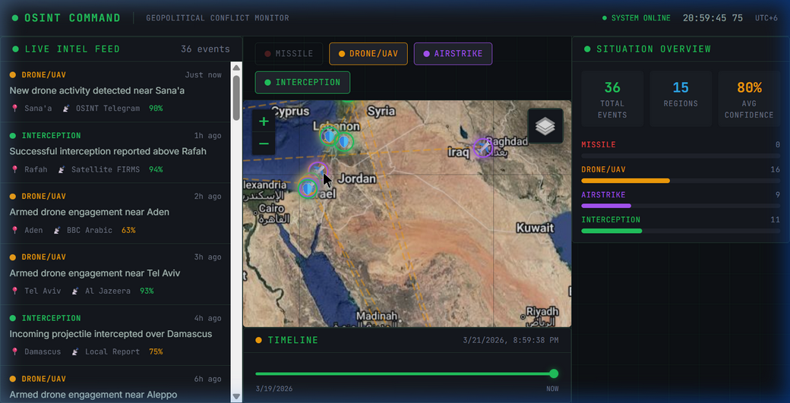

# 🧭 Conflict Compass

**Conflict Compass** is an advanced, open-source Geopolitical OSINT (Open-Source Intelligence) Dashboard. It provides a real-time, tactical visualization of global conflicts, civilian tracked data, and active threat radii on an interactive dark-mode map.

Developed independently by [**Prathmesh Mutke**](https://github.com/PrathmeshMutke).

🌍 **[Live Demo Available Here](https://PrathmeshMutke.github.io/conflict-compass/)**

<br>

<div align="center">
  
</div>

---

## 🔍 How It Works (Step-by-Step Analysis)

### Step 1: Live Intelligence Ingestion
The dashboard automatically initiates a connection to the **OpenSky Network REST API** out-of-the-box. Every 30 seconds, it fetches genuine aircraft telemetry. Simultaneously, the internal intelligence engine begins feeding simulated civilian maritime traffic and geopolitical combat alerts directly into the **Live Intel Feed** on the left panel.

### Step 2: Tactical Visualization
As data arrives, markers are actively plotted on the central CartoDB Dark Matter tactical map:
- **Neon Planes 🛩️** represent live, verified commercial flights.
- **Neon Markers (🚀, 🛸, ✈️, 🛡️)** represent geolocated threats like incoming missiles or drone routes.

Using the **Global Search Bar** at the top, you can instantly isolate specific events by typing a city name like *"Damascus"* or an ID.

### Step 3: Threat Analysis & Range Rings
Clicking on any marker (or feed item) forces the map to lock coordinates and zoom into the target zone. The system then automatically paints a pulsating **Threat Radius Ring** over the area:
- **Missiles:** 50km Blast Zones
- **Airstrikes:** 30km Impact Zones
- **Drones:** 15km Recon Zones

### Step 4: Situation Overview
Glance at the right-hand **Situation Overview** panel to monitor the statistical frequency of events. Finally, dragging the **Timeline Slider** across the bottom will scrub backward through time, allowing you to visualize exactly how the intel unfolded geographically over the last 48 hours.

---

## ✨ Features

- **Live FlightRadar Integration**: Fetches real-time, live coordinates for civilian aircraft directly from the OpenSky Network REST API every 30 seconds.
- **Tactical Intel Feed**: A constantly updating, scrollable feed of recent geopolitical events (mocked intelligence including Airstrikes, Drones, Missiles, and Interceptions).
- **Interactive Threat Radii**: Click on any intel event to instantly visualize a pulsating radar ring indicating its potential blast zone or scanning perimeter.
- **Global INTEL Search**: A blazing-fast search engine built right above the map to instantly filter out specific event IDs or city targets.
- **OSINT Dark Mode Theme**: Designed completely from scratch with a glassmorphic neon aesthetic, CartoDB Dark Matter tactical map tiles, and custom sub-pixel tracking animations.
- **Marine Traffic Ready**: Includes architectural support for plotting and tracking `vessels` (ships) along global trade routes.

## 🚀 Getting Started

### Prerequisites

You need `Node.js` (v18+) and `npm` installed on your machine.

### Installation

1. **Clone the repository:**
   ```bash
   git clone https://github.com/PrathmeshMutke/conflict-compass.git
   cd conflict-compass
   ```

2. **Install dependencies:**
   ```bash
   npm install
   ```

3. **Run the development server:**
   ```bash
   npm run dev
   ```

4. **Open the Dashboard:** Navigating to `http://localhost:8080/`

## 🛠️ Tech Stack

- **Framework**: `React 18` + `Vite`
- **Mapping**: `Leaflet` & `react-leaflet` with `CartoDB Dark Matter` Tiles
- **Styling**: `TailwindCSS` + Custom Keyframe Animations
- **UI Components**: `shadcn/ui` + `Radix UI` Primitive Components
- **Data Layers**: Custom Mock INTEL engine + **[OpenSky Network REST API]**

## 🤝 Contributing

Contributions, issues, and feature requests are welcome! If you have a real-time AIS Marine Traffic API key, feel free to open a PR to patch the simulated vessel feeds.

## 📝 License

This project is licensed under the MIT License.
